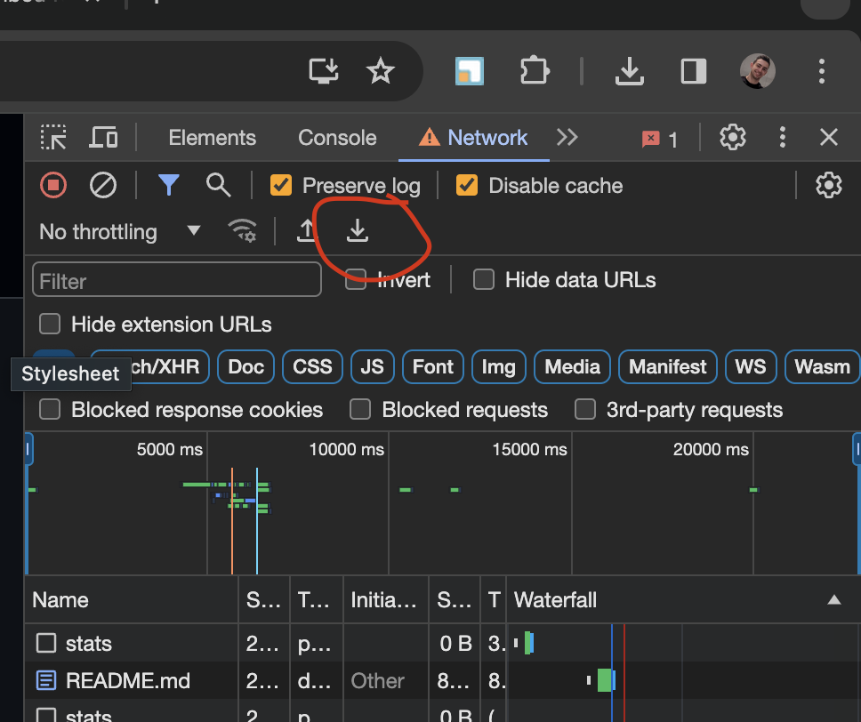
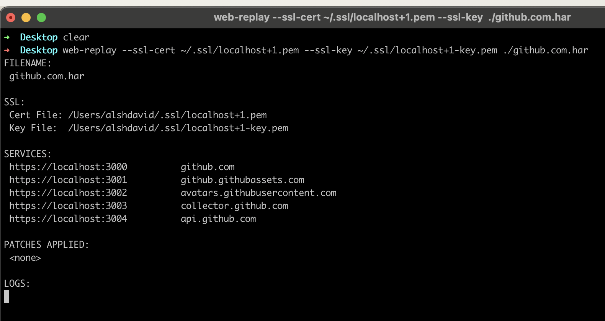
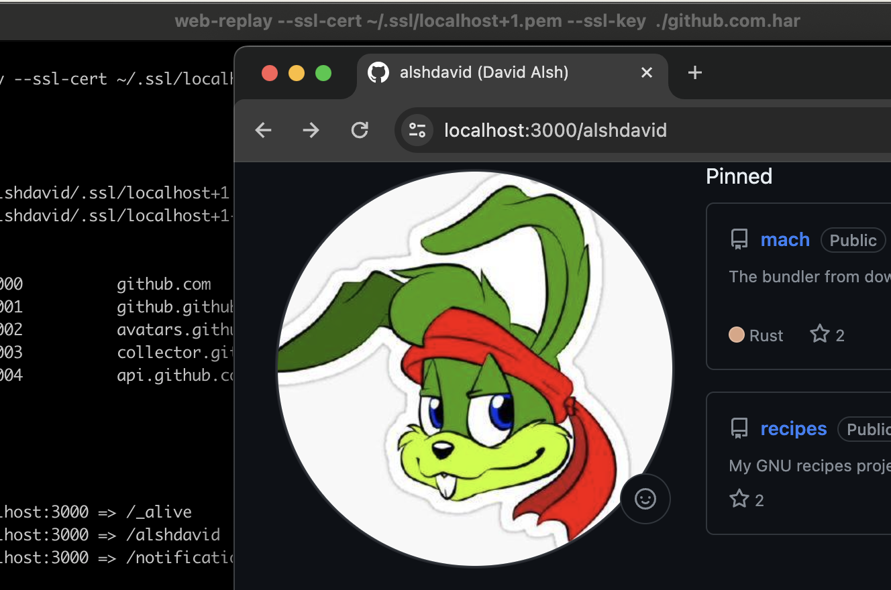

# Web Replay Tool (Replay .har)





## Introduction

This tool lets you replay an exported .har file from the DevTools network tab.

The tool spins up a local server and replays the requests stored in .har file on the local server.

I wrote this tool for performance testing the client-side portion of a web app as it removed the latency introduced by the server and allowed me to test the client-side performance - but it can be used for website archiving, modifying content for demos and so on. 

Thought it might be useful for someone.

## Usage

First, record your network activity from your live site and save the network tab to a `.har` file.

Only the requests in the network tab can be replayed so make sure you reload your page to capture the initial request.

You can click on "preserve logs" to store multiple pages.

Once you have a `.har` file exported from the network DevTools, pass it into the `web-replay` tool. 

```
web-reply -ssl-key ~/.ssl/localhost+1-key.pem -ssl-cert ~/.ssl/localhost+1.pem ./your.har
```

Open Chrome on `https://localhost:3000/path/you/saved`.

Make sure to use the complete path to the page your exported. 

For example, if I export the har file from `https://github.com/alshdavid/web-replay` I will need to go to `https://localhost:3000/alshdavid/web-replay`.

This will replay the `.har` file exactly but it will not allow you to use the entire app.

## SSL / HTTPS

This only serves HTTPS traffic as HTTP traffic behaves differently and can cause issues when replying sites saved from HTTPS sources.

You will need to supply a self-signed SSL certificate to the tool. 

I recommend using [mkcert](https://github.com/FiloSottile/mkcert) as it's a one line command that does everything for you.

```bash
mkdir ~/.ssl
cd ~/.ssh
mkcert -install
mkcert localhost 127.0.0.1
ls

> localhost+1-key.pem  localhost+1.pem
```

## Patching Sites

You can patch responses, add latency, inject scripts and modify the responses.

Add patches to the `patches/enabled` folder next to the binary to run them.

You can see examples here: [patches/disabled](https://github.com/alshdavid/web-replay/tree/main/commands/web-replay/patches/disabled)

## Installation

### MacOS

```bash
rm -rf $HOME/.local/web-replay
mkdir -p $HOME/.local/web-replay
curl -L --url https://github.com/alshdavid/web-replay/releases/latest/download/darwin-arm64.tar.gz | tar -xvzf - -C $HOME/.local/web-replay
export PATH=$HOME/.local/web-replay/bin:$PATH
```

Add the following to your `~/.zshrc` and/or `~/.bashrc`

```bash
export PATH=$HOME/.local/web-replay/bin:$PATH
```

### Linux

```bash
rm -rf $HOME/.local/web-replay
mkdir -p $HOME/.local/web-replay
curl -L --url https://github.com/alshdavid/web-replay/releases/latest/download/linux-amd64.tar.gz | tar -xvzf - -C $HOME/.local/web-replay
export PATH=$HOME/.local/web-replay/bin:$PATH
```

Add the following to your `~/.zshrc` and/or `~/.bashrc`

```bash
export PATH=$HOME/.local/web-replay/bin:$PATH
```