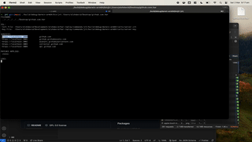

# Web Replay Tool (Har File Re-player)

<p align="center"></p>

## Usage

First, record your network activity from your live site and Save the network tab to a `.har` file.

```
web-reply -ssl-key /localhost.key -ssl-cert /localhost.cert ./your.har
```

You will need to generate a self-signed SSL certificate. I recommend using [mkcert](https://github.com/FiloSottile/mkcert) as it's a one line command that does everything for you.

Open Chrome on `https://localhost:3000/path/you/saved`

This will replay the `.har` file exactly, but it will not allow you to use the entire app.
